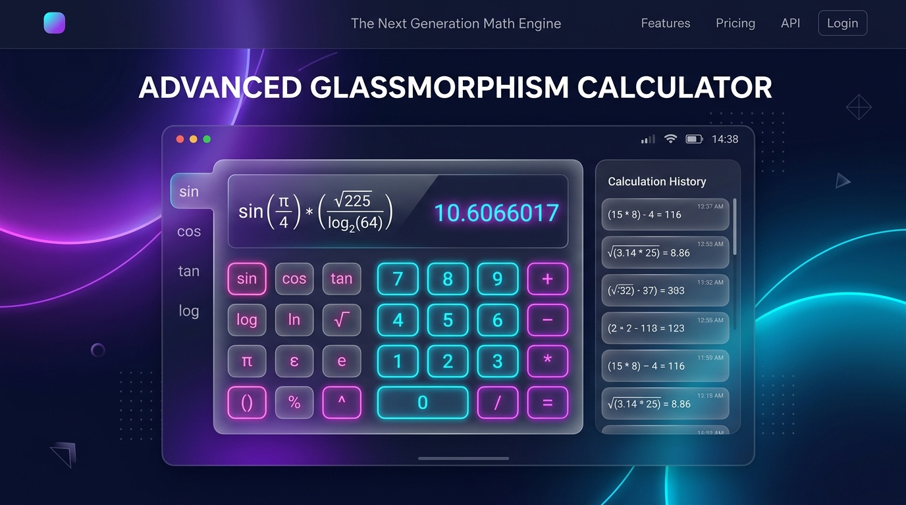

<div align="center">

# 🧮 Advanced Glassmorphism Calculator
### *The Next-Generation Scientific Math Engine & Minimalist Glass UI*

[](https://developer.mozilla.org/en-US/docs/Web/HTML)
[](https://developer.mozilla.org/en-US/docs/Web/CSS)
[](https://developer.mozilla.org/en-US/docs/Web/JavaScript)
[](https://developer.mozilla.org/en-US/docs/Web/API/Web_Audio_API)
[](LICENSE)

<br />

<p align="center">
  
</p>

### 🌟 [Report Issue / Feedback](https://github.com/codexanjan/digitalcalculator/issues)

</div>

<br />

**Advanced Glassmorphism Calculator** is a high-precision, responsive scientific calculator web application designed with modern glassmorphism aesthetics, fluid micro-interactions, persistent calculation history, and synthesized audio feedback.

---

## ✨ Features

- **📐 Basic & Advanced Scientific Operations**:
  - Trigonometric functions: `sin`, `cos`, `tan` (with radians/degrees modes)
  - Logarithmic operations: `log₁₀`, `ln`
  - Exponentials, square roots, factorials (`n!`), powers (`xʸ`), percentages (`%`), and constants ($\pi, e$).
- **🎨 Glassmorphism Design System**:
  - Multi-layered frosted glass effect with CSS `backdrop-filter: blur(16px)`.
  - Ambient glowing gradients, reactive ripple button presses, and neon hover highlights.
- **🌗 Dark / Light Mode Switching**:
  - Smooth 1-click theme transition with color variable adaptation and saved user preference.
- **📜 Calculation History Tape**:
  - Automatically records previous equations and results to browser `localStorage`.
  - Re-insert past results directly into your current formula with a single click.
- **💾 Memory Registers**:
  - Standard memory capabilities: `MC` (Clear), `MR` (Recall), `M+` (Add), and `M-` (Subtract) with visual indicators.
- **⌨️ Complete Keyboard Navigation**:
  - Full hardware keyboard mapping for lightning-fast calculations without touching the mouse.
- **🎙️ Web Speech Voice Input**:
  - Experimental voice input recognition allowing you to speak mathematical operations aloud (supported on Chrome/Edge).
- **🔊 Web Audio API Sound Effects**:
  - Subtle synthesized mechanical clicks and feedback tones generated procedurally via the browser's native audio engine.
- **🛡️ Secure Mathematical Evaluation**:
  - Strict input sanitization and AST-based parsing that guards against insecure global `eval` vulnerabilities.

---

## ⌨️ Keyboard Shortcuts

| Key | Operation |
| :--- | :--- |
| `0` – `9`, `.` | Numeric input and decimal point |
| `+`, `-`, `*`, `/` | Basic arithmetic operators |
| `Enter` or `=` | Calculate result |
| `Backspace` | Delete last character |
| `Escape` | Clear calculation display (`C`) |
| `(` and `)` | Parentheses grouping |
| `Ctrl + C` | Copy current calculation result to clipboard |

---

## 🛠️ Technology Stack

- **HTML5**: Semantic markup with ARIA accessibility roles.
- **CSS3 / Vanilla CSS**: Custom properties (CSS Variables), backdrop filters, flexbox, grid, and CSS keyframe animations.
- **JavaScript (ES6+)**: Zero external npm dependencies. Native DOM manipulation, LocalStorage API, Web Audio API oscillator synthesis, and Web Speech API.

---

## 🚀 Quick Start

No installation, build tools, or server setup needed!

1. **Clone the repository:**
   ```bash
   git clone https://github.com/codexanjan/digitalcalculator.git
   cd digitalcalculator
   ```

2. **Open the app:**
   Simply double-click `index.html` to open it directly in your favorite web browser, or serve it with any static server:
   ```bash
   npx serve .
   ```

---

## 📁 Repository Structure

```
digitalcalculator/
├── assets/
│   └── preview.png        # High-resolution showcase banner
├── index.html             # Application layout & semantic structure
├── style.css              # Glassmorphism themes, responsive grid, animations
├── script.js              # Calculation engine, audio synthesis, history logic
├── SECURITY.md            # Security policy & reporting
└── README.md              # Project documentation
```

---

## 📄 License
Distributed under the **MIT License**. See `LICENSE` for details.

---

## 👤 Author
Crafted with ❤️ by **[Anjan Shetty](https://github.com/codexanjan)**.
